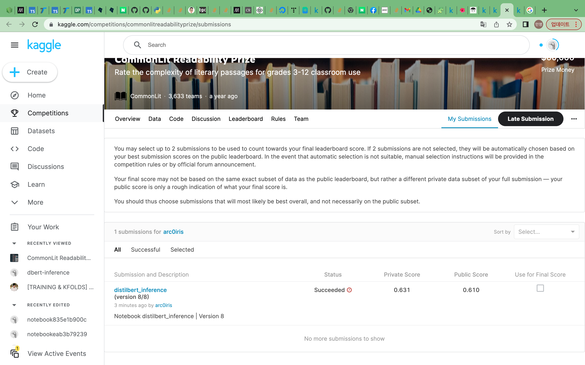
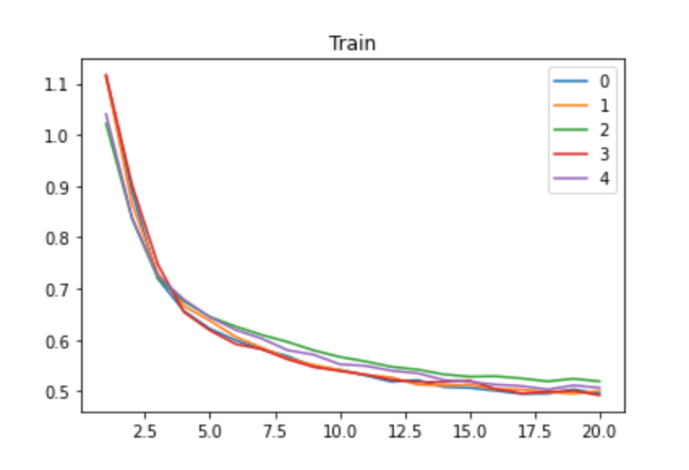
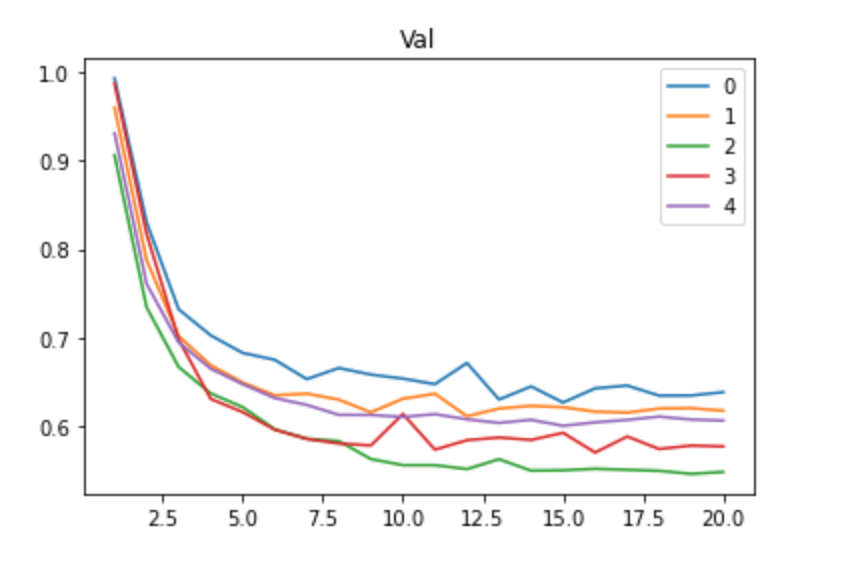

# Question3 Kaggle

### Kaggle에 제출한 submission의 캡쳐이미지

> Cannot submit
Your Notebook cannot use internet access in this competition. Please disable internet in the Notebook editor and save a new version.
Your Notebook uses non-versioned datasets [/soulmachine/pretrained-bert-models-for-pytorch] (see Dataset Settings).

### 학습/검증 로그

### 솔루션 설명

Knowledge Distillation을 활용한 DistilBERT를 모델로 선택하였습니다.

DistilBERT로 특징을 추출한 뒤에는 CLS Token의 Last Hidden State를 Sentence Embedding으로 활용했습니다.

이후 Linear Layer를 활용해서 Readability에 대한 예측을 수행했습니다.

### 코드 재현 방법

본 Notebook을 다운로드한 뒤 Kaggle에서 그대로 실행시켜주시면 됩니다.

### 참고한 자료

[[TRAINING & KFOLDS] PyTorch BERT-Large w/o OOM🎯](https://www.kaggle.com/code/heyytanay/training-kfolds-pytorch-bert-large-w-o-oom)
